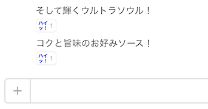

# hubot-slack-ultrasoul



B'zのウルトラソウルのリズムで読める発言にreactionを追加する

## インストール

npmでインストール

```
$ cd /path/to/hubot
$ npm install --save knjcode/hubot-slack-ultrasoul
```

`external-scripts.json`へスクリプトを登録

```
$ cat external-scripts.json
[
  "hubot-slack-ultrasoul"
]
```

## 設定

reactionする絵文字(デフォルトはraising_hand)を変更したい場合は環境変数 `HUBOT_SLACK_ULTRASOUL_REACTION` に絵文字の名前を設定する

## 参考

[slack-ikku](https://github.com/hakatashi/slack-ikku)を参考にさせて頂きました

## ライセンス

MIT
